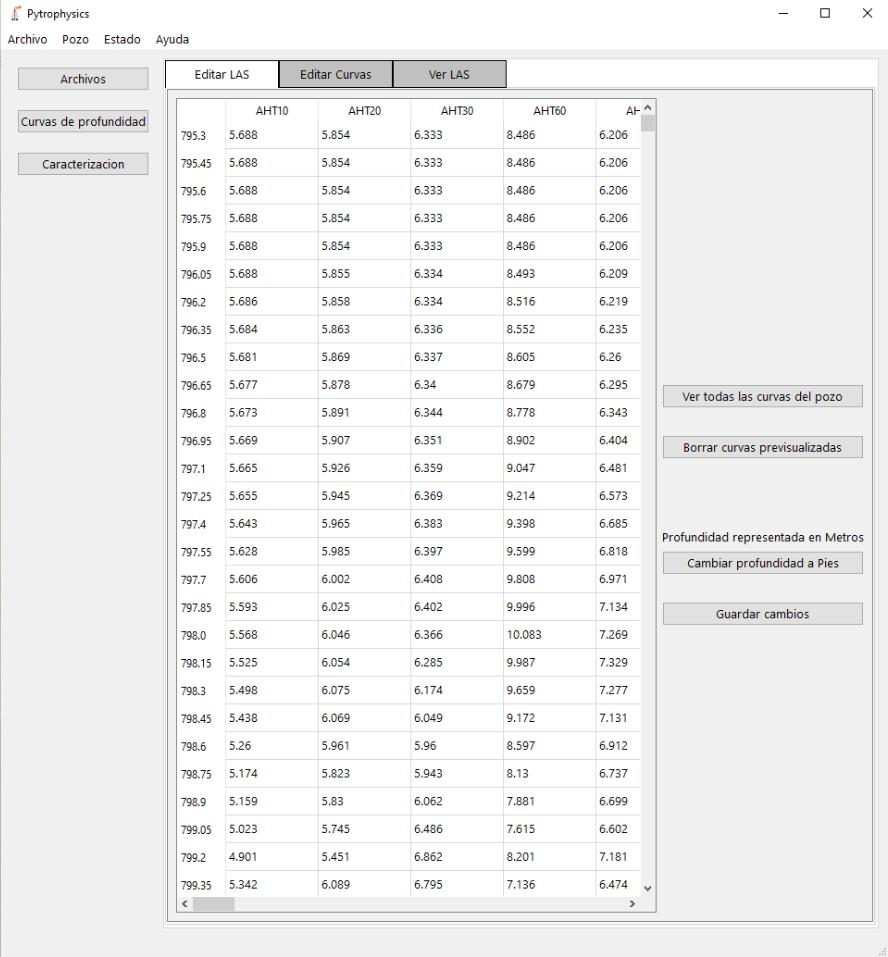
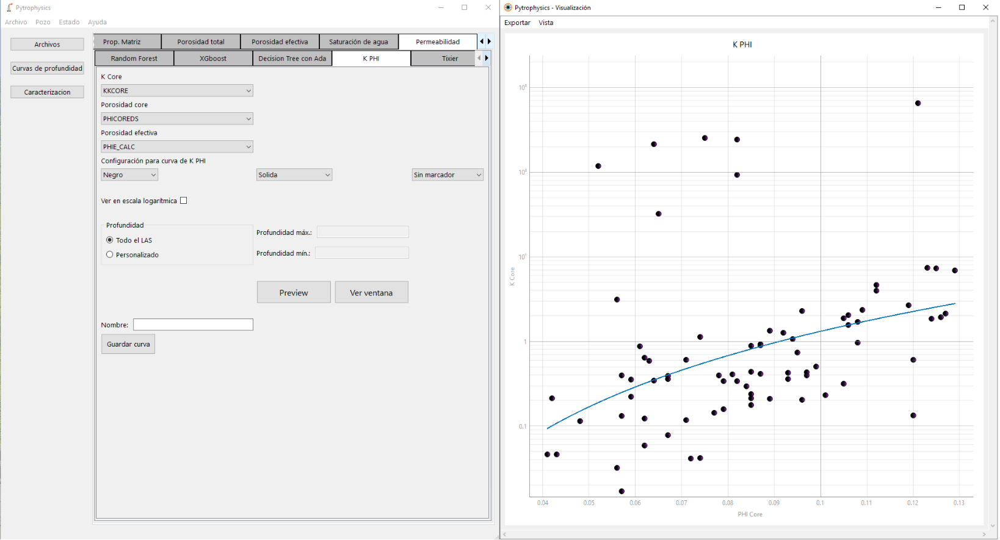
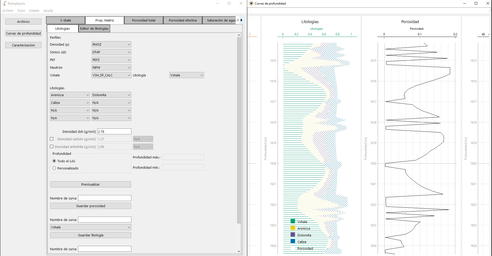
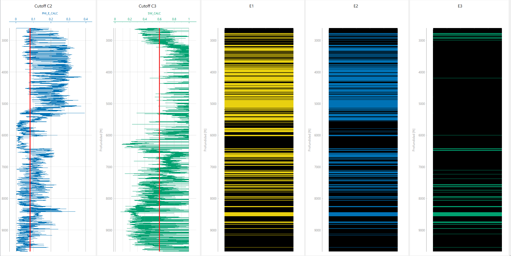
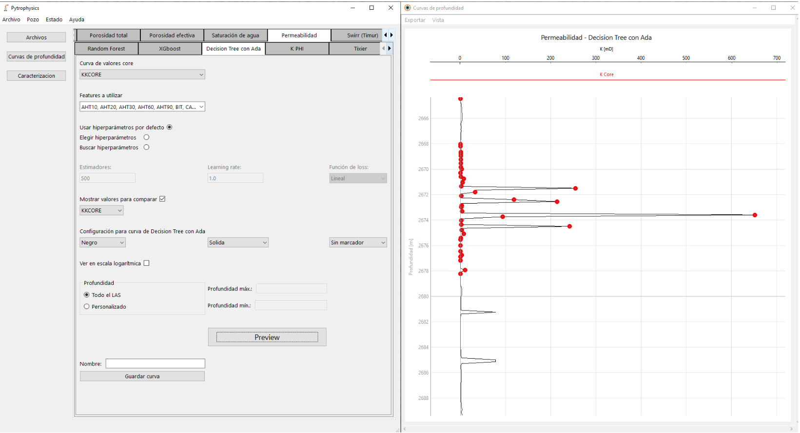

### Preview

## 1. Requisitos
• Windows 10
 
• Python 3.10: https://www.python.org/downloads/ (Incluir PIP en la instalacion)
 
• PyQt6, Pyqtgraph, Numpy, etc (ver requirements.txt)
 

## 2. Ejecuión
Para ejecutar el programa abrir, la terminal en la carpeta del proyecto 
(escribir en la ruta de la carpeta "cmd <RUTA CARPETA") y ejecutar el comando

`$ python main.py`

## 3. Compilación
Para generar un ejecutable (exe) independiente:

 

1) En el archivo "permeability_service.py" (que está dentro de la carpeta "services") descomentar la linea que dice "from sklearn_local.model_selection import GridSearchCV" y en su lugar comentar la linea que dice "from sklearn.model_selection import GridSearchCV". Esto se hace para usar la version local de GridSearch y no la de la biblioteca de SKLearn que genera conflictos al generar el ejecutable.

 

2) Correr el comando:
`$ python -m PyInstaller main.py --collect-all "xgboost" --noconsole --icon=media/logo_las.ico`

Sugerencia: Hacer una copia de la carpeta del proyecto y correr el comando sobre la copia de la carpeta,
              ya que se generan muchos archivos nuevos.

Esto genera dos carpetas, una llamada build que contiene los archivos usados por pyinstaller para generar
el ejecutable y una carpeta dist que es la que se usa para distribuir la aplicacion, dentro de esta carpeta
estará el ejecutable llamado main.exe correspondiente a la aplicacion.

 

3) Revertir el cambio hecho en el paso 1.

 

4) Copiar las carpetas:
- licenses;
- source_code, copiando allí el código fuente (para cumplir con GPL3);
- sklearn_local (pisando el que está).
- manual_originial.pdf;
- media; y
- modo_lectura 

dentro del directorio dist.

 
5) Como recomendación para la distribución, ponerle el nombre "Pytrophysics" a la carpeta principal y al "main.exe" y zipearlo.

 

6) Como recomendación para la instalación, crear un acceso directo al Pytrophysics.exe. Una vez que se ejecuta ya se puede buscar en
el buscador de Windows. En la sección de ayuda de la aplicación se tiene un vínculo al manual de la aplicación en su última versión
y al ejecutable del programa. En cualquier caso, se incluye una versión original del manual en pdf (manual_original.pdf) que contiene
fórmulas utilizadas en los cálculos que la aplicación realiza.

 

¿Qué es eso de sklearn_local?

GridSearch (de sklearn) usa multiprocess por detrás (a través de Parallel), el cual tiene 
problemas con PyInstaller, el módulo que se utiliza para generar un ejecutable del programa. 
En nuestro código, para poder utilizar multiprocess sin preocuparnos por la versión compilada, 
simplemente ponemos `multiprocessing.freeze_support()` antes del main, como se indica en la 
documentación. Sin embargo, esto no alcanza para los casos donde los módulos instalados, 
que son embedidos por PyInstaller al generar el ejecutable, utilizan multiprocess. 

El uso de la paralelización con multiprocess en un ejecutable de PyInstaller "a secas" 
desestabiliza completamente la aplicación, por lo que se tiene una versión "local" de sklearn 
que solo modifica una línea de código en el archivo _search.py del directorio model_selection 
(donde está GridSearch):

`parallel = Parallel(n_jobs=self.n_jobs, pre_dispatch=self.pre_dispatch)`

por

`parallel = Parallel(n_jobs=self.n_jobs, pre_dispatch=self.pre_dispatch, prefer="threads")`

 

Fuente:
https://github.com/pyinstaller/pyinstaller/issues/7008

 

## 4. Documentación técnica

### 4.1. Estructura base

Esquema de la jerarquía de los componentes gráficos:
 
. ScrollArea  
..   Widget (ventana)  
....      Layout (horizontal, vertical, etc.)  
......        GraphicsView  
........          GraphicsLayout  
..........          PlotItem  
............          Plot curve Item (dentro del viewbox)  
            
......         MenuBar  

### 4.2. Información general
• Sobre QT 
https://doc.qt.io/qtforpython/index.html

• Todos los componentes visuales deben ser atributos de una clase, 
sino se van a presentar insetabilidades que no van a permitir
usar el framework de pyqt correctamente 
(https://stackoverflow.com/questions/65152659/in-pyqt-why-somes-widgets-needs-the-self-parameter-before-calling-them-while).

• Al agregar atributos:
 
- En caso de que sean un combo de curvas, agregarlo al respectivo `curve_selectors`
- En caso de que sea algo cuyo estado interesa guardar, incluirlo en la respectiva llamada a la función
`add_serializable_attributes`
- En caso de que lo ingresado deba ser un número, agregarlo al respectivo `numeric_inputs` y agregar 
validaciones según el tipo de número.

• Todos los nombres de tracks reservados deberían ir en TRACK_NAMES (general_constants).

• Lo que define una estructura debería ir en models.

• Lo que se pueda reutilizar de lógica (por ejemplo, cálculos) debería ir en un service.

• Lo que se pueda reutilizar que sea visual debería ir en un 
componente, en el caso de no recibir parámetros (como `StyleCombos`) 
o en un handler en el caso de recibirlos (como `rectangle_handler`, 
para agregar un rectángulo).

• Gracias al método `add_tabs` de la clase base `QWidgetWithWell`, las tabs creadas
que hereden de este widget tienen barra de scroll por defecto (no hace falta
agregarla en cada tab nueva que se crea). También viene con un `GridLayout` 
por defecto, y métodos que lo wrappean, para ahorrar tiempo en la mayoría de 
los casos.

### 4.3. Interfaz para graficar
• Si una curva tiene el mismo nombre en el track/pista, se reemplaza.

### 4.4. Flags de las curvas
• `tab_name`: Nombre del grupo de pistas al que pertenece la pista donde estará la curva. 
Los grupos de pistas se corresponden con las secciones o subsecciones de cálculos de la aplicación. 
Por ejemplo, el cálculo "GR" de la sección "VShale" tiene el tab_name "GR". Esto es útil, por ejemplo, 
para actualizar solo las pistas correspondientes a un cálculo cuando la previsualización del mismo se actualiza.

• `track_name`: nombre con el que se identifica a la pista donde estará la curva. Se muestra como título en la pista, 
y en el caso de las curvas de profundidad, es la forma en que los usuarios puede identificar la pista a
modificar en la pantalla de edición respectiva.

• `curve_name`: nombre con el que se identifica a la curva.  En el caso de las curvas de profundidad, 
es la forma en que los usuarios puede identificar la pista a modificar en la pantalla de edición respectiva.

• `x_axis`: conjunto de coordenadas x de los valores a graficar.

• `y_axis`: conjunto de coordenadas y de los valores a graficar. 
En el caso de las curvas de profundidad, es el intervalo de profundidad del pozo

• `y_label`: leyenda para el eje y.

• `x_label`: leyenda para el eje x.

• `cummulative`: Booleano que indica si usa la escala de la curva superior, en vez de la propia, 
al representar la curva. El comportamiento por defecto es que no estén en la misma escala, sino que se 
dibujen "superpuestas" sobre el viewbox dado por el primer eje (que es el de la primera curva que se grafica). 

• `add_axis`: Booleano que indica si se debe agregar un eje para la curva (arriba de la pista).
Se puede poner en falso, por ejemplo, para conjuntos de valores que no cambian con la profundidad, 
como ocurre con los gráficos de espesores. Por defecto está en verdadero, es decir, 
se agrega un nuevo eje por cada curva.

• `legend`: Nombre de la curva a mostrar en un cuadro de referencias, en el caso de que se utilice. 
Una de los gráficos que lo utiliza es el de litologías.

• `line_width`: Entero para indicar el grosor de la curva a graficar. Por defecto es 1.

• `color`: Nombre del color utilizado para la curva. Las opciones son "Negro", "Rojo", "Amarillo", 
"Azul", "Verde", "Violeta", "Naranja", "Magenta", "Marrón", "Rosa", "Celeste", "Verde azulado", 
"Oliva", "Coral", "Gris", "Oxido" y "Blanco".

• `line_style`: Nombre del tipo de línea para la curva. Las opciones son "Solida", "Guion", "Punto",
"Guion y Punto", "Guión y doble punto".

• `line_marker`: Nombre del tipo de marcador para la curva. Las opciones son "Punto", "Triangulo Bajo", 
"Triangulo Arriba", "Triangulo Izquierda", "Triangulo Derecha", "Cuadrado", "Pentagono", "Hexagono", 
"Estrella", "Cruz", "Rombo", "Flecha abajo", "Flecha arriba", "Flecha izquierda" y "Flecha derecha".

• `x_adjusted`: booleano para indicar si el eje X debe tener un rango forzado.

• `x_adjusted_min`: valor mínimo forzado para el eje x.

• `x_adjusted_max`: valor máximo forzado para el eje x.

• `no_grid`: booleano que indica que no se debe utilizar una grilla griseada al graficar la curva, la
cual extiende los valores de referencia del eje de la curva. Por defecto, está en falso.

• `invisible`: booleano que indica si la curva es invisible. Por defecto, está en falso.

• `is_reverse`: booleano que indica si el eje horizontal de la curva debe estar invertido. Por defecto, 
está en falso.

• `scatter_curve`: booleano que indica si la curva debe ser estructurada para una ventana de scatterplots (es
decir, su eje y no será la profundidad del pozo). Por defecto, está en falso.

• `is_log`: booleano que indica si el eje horizontal de la curva debe visualizarse en escala logarítmica. Por
defecto, está en falso.

• `is_y_log`: booleano que indica si el eje vertical de la curva debe visualizarse en escala logarítmica. Por
defecto, está en falso.

### 4.5. Flags exclusivos para curvas de scatterplots
• `left_label`: leyenda para el eje vertical.

• `bottom_label`: leyenda para el eje horizontal.

• `custom_curve`: booleano que indica si se utiliza una curva de tendencia especial. Por defecto, está en falso.

• `x_values`: conjunto de valores para el eje x, en caso de que se utilice una curva de tendencia propia. Por defecto, está en falso.

• `y_values`: conjunto de valores para el eje y, en caso de que se utilice una curva de tendencia propia. Por defecto, está en falso.

• `custom_line`: booleano que indica si se utiliza como línea de tendencia una recta identidad. Por defecto, está en falso.

### 4.6. Flags exclusivos para curvas de histogramas
• `title`: título del histograma.

• `x_axis_title`: leyenda para el eje "x" del histograma.

• `y_axis_title`: leyenda para el eje "y" del histograma.

• `invert_x`: booleano que indica si el eje "x" del histograma debe estar invertido.

• `invert_y`:  booleano que indica si el eje "y" del histograma debe estar invertido.

• `log_x`: booleano que indica si el eje x del histograma debe verse en escala logarítmica.

• `buckets`: cantidad de "buckets" del histograma.

• `histogram_groups`: lista con los histogramas a mostrar. Cada uno está definido por un diccionario de valores

### 4.7. Flags exclusivos para grupos de histogramas
• `values`: conjunto de valores del eje x para el grupo.

• `histogram_name`: nombre con el que se identifica al grupo.

• `color`: color del histograma. Las opciones son "Negro", "Rojo", "Amarillo", "Azul", "Verde", "Violeta", "Naranja", "Magenta", "Marrón", "Rosa", "Celeste", "Verde azulado", "Oliva", "Coral", "Gris", "Oxido" y "Blanco". 

• `alpha`: valor entero de alpha para el color del histograma. Los valores posibles van de 0 a 255. 

• `show_accum`: booleano que indica si el histograma se muestra en forma acumulada.   

• `alpha_accum`: valor entero de alpha para los valores acumulados. Los valores posibles van de 0 a 255. 

• `front`: booleano que indica si el histograma debe estar por encima de los histogramas anteriores.

### 4.8. Combos
• <b> Crear un combo de colores o tipos de línea </b>  
Usar los métodos de `StyleCombos`.
 

• <b> Crear un combo con las curvas del pozo </b>  
Ver `combo-handler`.
 

• Para actualizar todos los co de una pantalla utilizar el 
atributo de QWidgetWithWell: `curve_selectors`

### 4.9. Otros
• <b> Usar letras griegas </b>  
Ver `string_service`.

## 5.  Notas
• Perfil = Curva

• Densidad = RHO = RHO b (comunmente medido en [g/cm3])

• Porosidad total = Neutrón = PHI (comunmente medido en GAPI, o porcentaje o fracción)

• Acoustic = DT = t  = Delta t = Sonico = Sónico compresional  (comunmente medido en [µs/ft])

• Factor fotoeléctrico = PEF = PE   (adimensional, [VARNS/e])

• Permeabilidad = k (comunmente medido en [mD])

• El swirr y la permeabilidad debe calcularse con la porosidad efectiva

• El Vshale tiene que hacerse máximo cuando la porosidad efectiva se hace mínima.

• El Dual Water es la que suele dar más distinta, pero cuando hay poca arcillosidad (Bajo VSHALE), todas las saturaciones tienen que dar parecidas a Archie.

• La curva de PayFlag (que vale 1 cuando se cumplen las condiciones de cutoff definidas) se calcula en la pestaña de "Espesores" (Thickness) dentro de la pestaña de Parámetros de Corte (cutoff).

• Unidades: si no se indica otra cosa, es una unidad adimensional

• Valores coumnes para un análisis de cutoff:
- 0.3 (vshale), 0.08 (porosidad, por encima) y 0.6 (sw, saturación de agua)
- phi fluído = 1  (asumir que es agua)

- Una constante de proporcionalidad para Swirr: 0.136
